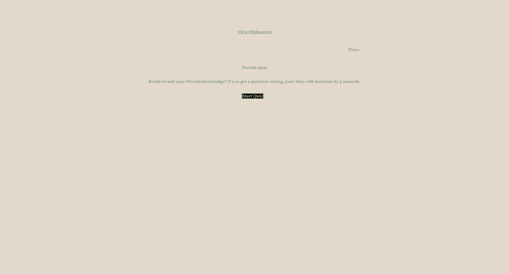

# code-quiz
Code quiz that tracks scores on the screen

## code-quiz homework ucf bootcamp

## composed by
Stephanie Chaparro

## project location ##
[repo link](https://github.com/schaparro08/code-quiz)
[live link](https://schaparro08.github.io/code-quiz/)

**contact information**
schaparro2021@gmail.com

## Project example

## Description

The code quiz uses Javascript logic in order to set up a game where each wrong answer decreases the amount of time you have by 5 seconds. The time remaining is your score.

The code quiz uses local storage, in order to save the top 5 scores and place them on another page.

